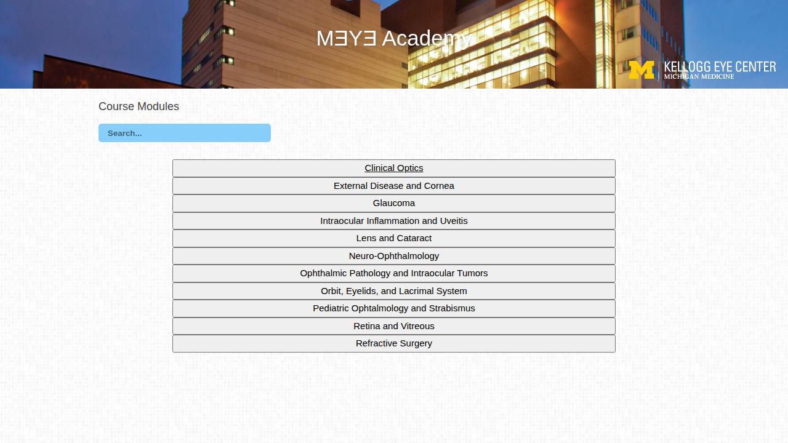

# MƎYƎ Academy 👁️

[](http://kellogg.umich.edu/)
[](LICENSE)

A comprehensive educational resource platform for ophthalmology residents and fellows at the University of Michigan Kellogg Eye Center. MƎYƎ Academy provides organized access to course materials, lectures, grand rounds, and resources across all major ophthalmology subspecialties.



## ✨ Features

### 📚 Comprehensive Course Modules
Access educational resources across 11 core ophthalmology subspecialties:
- **Clinical Optics** - Lectures, grand rounds, and external resources
- **External Disease and Cornea**
- **Glaucoma**
- **Intraocular Inflammation and Uveitis**
- **Lens and Cataract**
- **Neuro-Ophthalmology**
- **Ophthalmic Pathology and Intraocular Tumors**
- **Orbit, Eyelids, and Lacrimal System**
- **Pediatric Ophthalmology and Strabismus**
- **Retina and Vitreous**
- **Refractive Surgery**

### 🔍 Smart Search
Built-in search functionality allows quick filtering of course modules to find exactly what you need.

### 📖 Resource Categories
Each module organizes content into logical sections:
- **Lectures & Related Materials** - Core educational content
- **Grand Rounds / Eblasts** - Recent presentations and updates
- **Other KEC Resources** - Internal institutional materials
- **External Resources** - Curated links to reputable external content
- **Recommended Readings** - Essential literature and references

### 🎨 Modern, Responsive Design
- Clean, professional interface optimized for desktop and mobile devices
- Smooth animations and transitions for enhanced user experience
- University of Michigan Kellogg Eye Center branding

## 🛠️ Technology Stack

- **Frontend**: HTML5, CSS3, JavaScript
- **Framework**: Bootstrap 3.x for responsive layout
- **UI Components**: 
  - Font Awesome for icons
  - Magnific Popup for lightboxes
  - WOW.js for scroll animations
  - Masonry for grid layouts
- **Fonts**: Google Fonts (Open Sans, Capriola, Raleway, Karma)

## 🚀 Getting Started

### Prerequisites
- A modern web browser (Chrome, Firefox, Safari, or Edge)
- A web server (optional for local development)

### Local Development

1. **Clone the repository**
   ```bash
   git clone https://github.com/ajaayc/kec-class.git
   cd kec-class
   ```

2. **Serve the files locally**
   
   Using Python:
   ```bash
   python3 -m http.server 8000
   ```
   
   Using Node.js:
   ```bash
   npx http-server -p 8000
   ```
   
   Using PHP:
   ```bash
   php -S localhost:8000
   ```

3. **Open in browser**
   ```
   http://localhost:8000
   ```

### Production Deployment

The site consists of static HTML files and can be deployed to any web server:

1. Upload all files to your web server's public directory
2. Ensure the directory structure is maintained
3. Make sure the web server is configured to serve `.html` files
4. Access via your domain (e.g., `https://yourdomain.com/kec-class/`)

**Example deployment script:**
```bash
rsync -rtvu * user@server.com:/path/to/public_html/kec-class
```

## 📁 Project Structure

```
kec-class/
├── index.html              # Main homepage with course module list
├── optics.html            # Clinical Optics module page
├── screenshot.png         # Homepage screenshot
├── css/                   # Stylesheets
│   ├── style.css         # Main custom styles
│   ├── bootstrap.min.css # Bootstrap framework
│   ├── animate.css       # Animation library
│   └── ...
├── js/                    # JavaScript files
│   ├── scripts.js        # Custom functionality
│   ├── jquery-1.11.1.min.js
│   └── ...
├── img/                   # Images and assets
│   ├── icons/            # UI icons
│   ├── backgrounds/      # Background images
│   └── about/            # Logos and branding
├── bootstrap/            # Bootstrap framework files
├── font-awesome/         # Icon font library
└── elegant-font/         # Additional icon fonts
```

## 🎯 Usage

### For Students
1. Navigate to the homepage
2. Use the search bar to filter modules or scroll through the complete list
3. Click on any module button to access its dedicated resource page
4. Browse through categorized resources within each module

### For Administrators
To add a new module or update content:
1. Edit `index.html` to add new module buttons
2. Create a new HTML page for the module (following `optics.html` as a template)
3. Update links and resource lists within each module page
4. Deploy changes to the web server

## 🤝 Contributing

This is an educational resource for the University of Michigan Kellogg Eye Center. For contributions or updates:

1. Fork the repository
2. Create a feature branch (`git checkout -b feature/improvement`)
3. Make your changes
4. Commit with clear messages (`git commit -am 'Add new resource section'`)
5. Push to the branch (`git push origin feature/improvement`)
6. Open a Pull Request

## 📝 License

This project is maintained for educational purposes at the University of Michigan Kellogg Eye Center. All content is intended for educational use by ophthalmology residents and fellows.

## 🏥 About Kellogg Eye Center

The [W.K. Kellogg Eye Center](http://kellogg.umich.edu/) at the University of Michigan is one of the nation's leading academic ophthalmology departments, committed to excellence in patient care, education, and research.

## 📧 Contact

For questions, suggestions, or technical support regarding MƎYƎ Academy, please contact the Kellogg Eye Center education team.

---

<div align="center">
  <strong>Built with ❤️ for ophthalmology education at the University of Michigan</strong>
</div>
